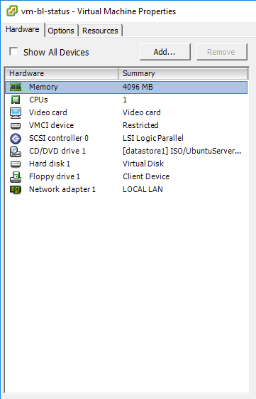

# vm-bl-status
The purpose of this repository is to document the set-up and configuration of the application server for the bl-status (*Box Loading Status*) system.

## Overview
The Box Loading **[bl-status]** system consists of a database of Box Loading status information, a REST WebAPI that provides external access to the database (and any intermediate data processing), and a front-end GUI web application that allows users to manage the Box Loading status information. These primary components are hosted on a single server (virtual machine). The following *Open Source* products and technologies are implemented:

* **Ubuntu Linux [16.04 LTS]:** Host Operating System (http://www.ubuntu.com)
* **MongoDB [version 3.4]:** NoSQL Database server (http://mongodb.org)
* **Django w/ REST Framework:** REST API Server & Administrative Web Application (http://djangoproject.com)
* **Nginx:** Reverse Proxy / Web Server (http://nginx.org)
* **Python [version 3]:** Popular and powerful Programming/Scripting Language. Underlying language for Django (http://python.org)
* **uWSGI:** Web Site Gateway Interface for Python-based applications (Django) - (http://uwsgi-docs.readthedocs.io/en/latest/)
* **Angular [version 4]:** Front-end Javascript Framework. Used to develop the GUI Web application (http://angular.io)

## Server OS (Ubuntu Linux) Installation & Configuration
The system is hosted on a Virtual Machine *[VMWare]*.  The Server OS is **Ubuntu 16.04 LTS**, a freely available Linux Operating system distribution.  A link to the installer image (ISO) is available here: https://www.ubuntu.com/download/server 

The initial hardware configuration is as shown bellow:

