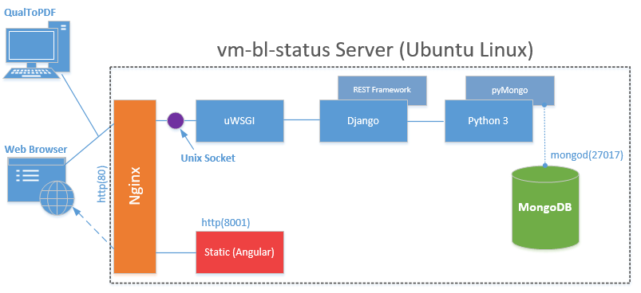
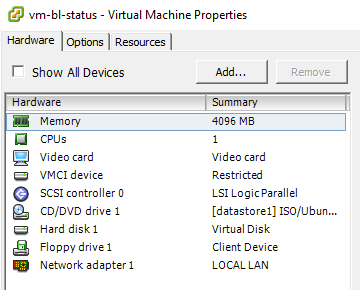
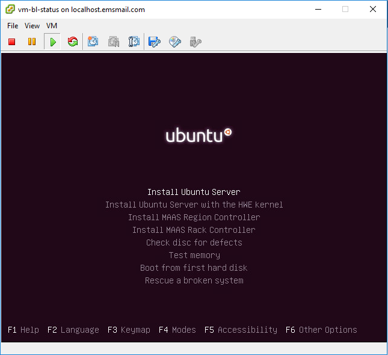
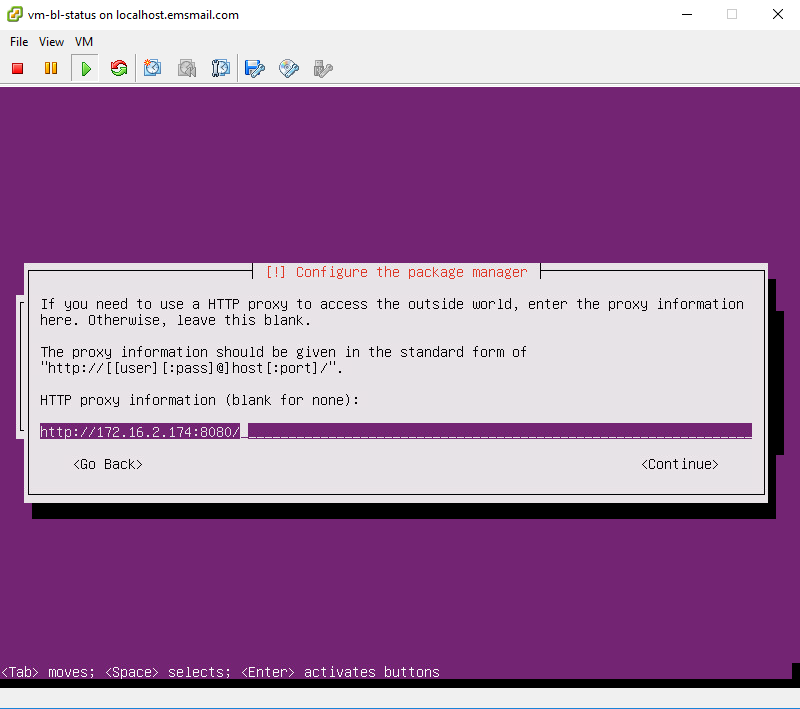
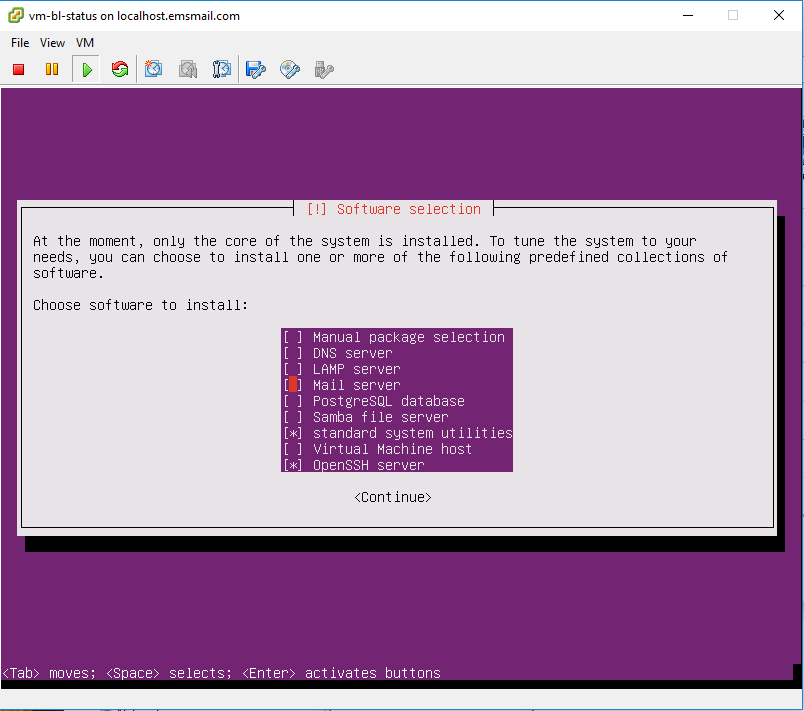
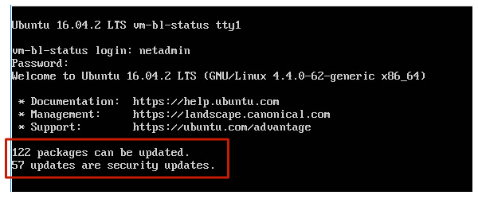
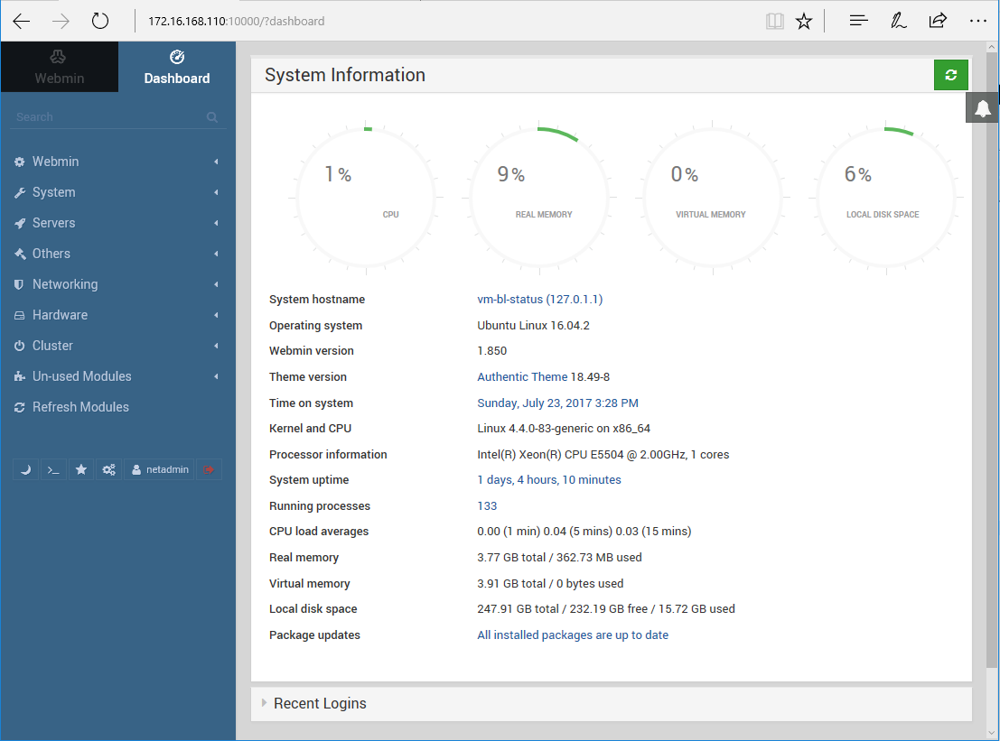
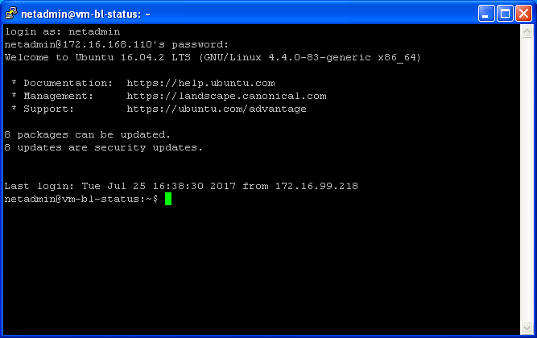
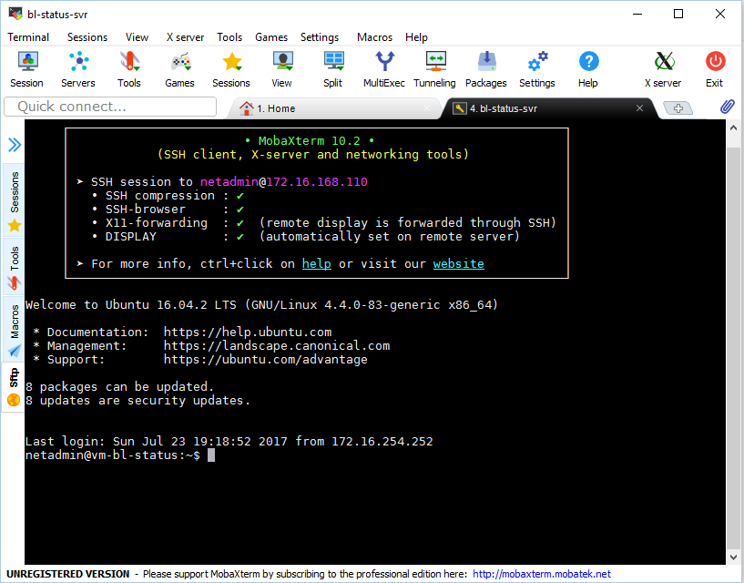

# vm-bl-status - Application Server
The purpose of this repository is to document the set-up and configuration of the Application Server for the **bl-status** (*Box Loading Status*) system.

## Overview
The **Box Loading Status** **[*bl-status*]** system consists of a ***Database*** of Box Loading Status information, a ***RESTful WebAPI*** that provides external access to the data (as well as performing any intermediate data processing), and a front-end ***Web-based GUI Application*** that allows users to manage the Box Loading status information. These primary components are hosted on a single server (a virtual machine). The Application Server is built entirely using the following, freely available, *Open Source* products and technologies:

* **Ubuntu Linux [16.04 LTS]:** Host Operating System (http://www.ubuntu.com)
* **MongoDB [version 3.4]:** NoSQL Database server (http://mongodb.org)
* **Django w/ REST Framework:** REST API Server & Administrative Web Application (http://djangoproject.com)
* **Nginx:** Reverse Proxy / Web Server (http://nginx.org)
* **Python [version 3]:** Popular and powerful Programming/Scripting Language. The underlying language for Django (http://python.org)
* **uWSGI:** Web Site Gateway Interface for Python-based applications (Django) - (http://uwsgi-docs.readthedocs.io/en/latest/)
* **Angular [version 4]:** Front-end Javascript Framework. Used to develop the GUI Web application (http://angular.io)




## Server OS (Ubuntu Linux) Installation & Configuration
The system is hosted on a Virtual Machine *[VMWare]*.  The Server Operating System is **Ubuntu 16.04 LTS**, a widely-used and freely available Linux Operating system distribution.  A link to the installer image (ISO) is available here: https://www.ubuntu.com/download/server 

### OS Installation
The initial virtual hardware configuration is as shown bellow:



The Operating System is installed from the mounted ISO file:



The server requires a connection to the company's **Proxy Server** [ISA-01] in order to download system updates from the Internet.  The installer provides a prompt for the address of a Proxy Server.  The current EMS primary Proxy Server address is **[172.16.2.174:8080]**.  It is entered as shown below:



Accessing and managing the server is much more convenient from an external terminal session.  This done over a secured/encrypted SSH (Secure Shell) connection.  To enable this functionality during the installation process, the **OpenSSH Server** option should be selected, as shown below:



### Install OS Updates
After the initial OS installation is complete, there will be subsequent system updates and security patches made available to be installed. 



The Ubuntu Package Manager **(apt-get)** is used to retreive and install any available OS updates from Ubuntu's public online repsitories.  

Enter the commands below to perform the update:
```
$ sudo apt-get update
$ sudo apt-get upgrade
$ sudo apt-get dist-upgrade
```

### Configure Networking
The TCP/IP Networking configuration must be adjusted to be beter suited for a Server role.  This includes: Assigning a **Static IP address**, specifing **DNS Servers** to be used for name resolution on the Local LAN and the Internet, and enabling the Linux **Firewall** (w/ Ubuntu ufw) to protect the server from Network attacks (taken from: https://michael.mckinnon.id.au/2016/05/05/configuring-ubuntu-16-04-static-ip-address/).

Edit the system network settings file:
```
$ sudo nano /etc/network/interfaces
```
Update the network IP and DNS settings as shown bellow:
```
# This file describes the network interfaces available on your system
# and how to activate them. For more information, see interfaces(5).

source /etc/network/interfaces.d/*

# The loopback network interface
auto lo
iface lo inet loopback

# The primary network interface
auto ens160
#iface ens160 inet dhcp
iface ens160 inet static
        address 172.16.168.110
        netmask 255.255.0.0
        gateway 172.16.2.174
        dns-nameservers 172.16.2.167 8.8.8.8 8.8.4.4
        dns-domain emsmail.com
```

Enable the Linux Firewall (https://help.ubuntu.com/community/UFW):
```
$ sudo ufw enable
```

### Install Remote Management GUI (Webmin)
**Webmin** is an popular Open Source Web-based Unix/Linux system management tool (http://webmin.com). It provides a comprehensive set of GUI tools to help with monitoring and performing common Linux system management tasks. Installation requires adding the software's repository key, location, and signature in the Ubuntu Package Manger (taken from: http://www.techrepublic.com/article/how-to-install-ubuntu-server-16-04-and-the-web-based-admin-tool-webmin/). 

First, create/edit a new Ubuntu Package Manager (apt-get) Source Repository URL list:
```
$ sudo nano /etc/apt/sources.list.d/webmin.list
```
Then, add the line, below, to the text file and save it:
```
$ deb http://download.webmin.com/download/repository sarge contrib
```
Next, get the Webmin PGP key signature file, which is required by the Package Manager to trust the repository:
```
$ wget http://www.webmin.com/jcameron-key.asc
$ sudo apt-key add jcameron-key.asc
```
Run the Package Manger's *update* process to force the inclusion of the newly-added Webmin repository:
```
$ sudo apt-get update
```
Then install the Webmin package:
```
$ sudo apt-get install webmin
```
Given the low security nature of this application, disable the SSL (encrypted) connection by editing the Webmin's Web Server (Miniserv) settings:
```
$ sudo nano /etc/webmin/miniserv.conf
```
Change the **ssl=1** setting to **ssl=0**

Next, allow the default TCP Port [10000] through the firewall, via the ufw Firewall configuration tool (https://help.ubuntu.com/community/UFW):
```
$ ufw allow from any to any port 10000
```
The Webmin GUI will then be availble via the URL: http://172.16.168.110:10000



### External Access from a Terminal
After the inital Operating System installation is complete, remote Terminal access to the server is more convenient than working directly in the local console (VMWare). Linux is a true multi-user Operating System. And, like with a traditional Mainframe OS, Linux allows for mutliple, simultaneous, Terminal connections/sessions over a TCP/IP network. Telnet (or TN3270) has been used in the past, but modern Unix/Linux terminal sessions are implemented through **SSH** (Secure Shell). SSH-based connections are secured through encryption.

**PuTTY** (http://www.putty.org) is a popular, bare-bones, and freely available, client-side program for SSH terminal sessions. It provides all the basic Terminal fucntionality needed to remotely work on a Linux server.



**MobaXterm** (http://mobaxterm.mobatek.net/) is a freely available, more robust and feature-rich Terminal client application for Windows. In addition to the expected Terminal functionality, there are many other SSH-related tools (sftp, ftp, RDP, text editor, etc...):



### Install MongoDB Database Server
**MongoDB**, a widely-used Open Source NoSQL database system, is used to store the Box Loading status information.  The REST API will process incoming **CRUD** (**C**reate **R**ead **U**pdate **D**elete) requests (mapped from http verbs: POST, GET, PUT, & DELETE) using the **PyMongo** library for MongoDB (https://api.mongodb.com/python/current/). The PyMongo library allows the Django Python code to connect and submit quereies to the MongoDB database.  The bl-status system uses the freely available **Community Edition** of MongoDB.  The current version is: **[3.4]**. 

The first step is to import the MongoDB public GPG/PGP key file into the Ubuntu Package Manager (to verify the authentcity of the software package):
```
$ sudo apt-key adv --keyserver hkp://keyserver.ubuntu.com:80 --recv 0C49F3730359A14518585931BC711F9BA15703C6
```
Next, create a new Package Manager repository list file for MongoDB:
```
$ echo "deb [ arch=amd64,arm64 ] http://repo.mongodb.org/apt/ubuntu xenial/mongodb-org/3.4 multiverse" | sudo tee /etc/apt/sources.list.d/mongodb-org-3.4.list
```
Run the Package Manger's *update* process to force the inclusion of the newly-added MongoDB repository:
```
$ sudo apt-get update
```
Next, download/install the MongoDB software:
```
sudo apt-get install -y mongodb-org
```
After installing the MongoDB, it needs to be configured to automatically start up when the Operating System boots (or re-boots). In order to do this, the Ubuntu Linux service manager **(systemd)** must be confifured to manage MongoDB (taken from:	https://docs.mongodb.com/manual/tutorial/install-mongodb-enterprise-on-ubuntu/ & https://www.mkyong.com/mongodb/mongodb-allow-remote-access/):

- A new systemd service configuration file must be created by issuing the command below:
```
$ sudo nano /etc/systemd/system/mongodb.service
```
- Paste the following contents into the text file:
```
[Unit]
Description=High-performance, schema-free document-oriented database
After=network.target

[Service]
User=mongodb
ExecStart=/usr/bin/mongod --quiet --config /etc/mongod.conf

[Install]
WantedBy=multi-user.target
```
- Next, start the newly-defined service:
```
$ sudo systemctl start mongodb
```
- to verify the service running, type the following command:
```
$ sudo systemctl status mongodb
```
The output should be similar to below:
```
mongodb.service - High-performance, schema-free document-oriented database
   Loaded: loaded (/etc/systemd/system/mongodb.service; enabled; vendor preset: enabled)
   Active: active (running) since Mon 2016-04-25 14:57:20 EDT; 1min 30s ago
 Main PID: 4093 (mongod)
    Tasks: 16 (limit: 512)
   Memory: 47.1M
      CPU: 1.224s
   CGroup: /system.slice/mongodb.service
           └─4093 /usr/bin/mongod --quiet --config /etc/mongod.conf
```
- Finally, enable the service to automatically start when the server boots:
```
$ sudo systemctl enable mongodb
```
For management, testing, and diagnostic purposes, external/LAN access to the MongoDB server is required.  The MongoDB IP binding configuration setting must be updated to allow outside/LAN IP access.  Also, the Linux Firewall must be updated to allow external/LAN access to the TCP Port that MongoDB listens on.

To allow external/LAN access to the database: 

- Update the MongoDB configuration file:
```
$ sudo nano /etc/mongod.conf
```
- Change the **bind_ip** parameter to include the **Server's** Static IP address:
```
# Listen to local and LAN interfaces.
bind_ip = 127.0.0.1,172.16.168.110
```
To allow MongoDB traffic through the Linux Firewall, enter the following **ufw** command:
```
$ sudo ufw allow from any to any port 27017
```

### Prepare Django Environment with uWSGI and Nginx
The **WebAPI** for the bl-status system is built with the widely used Django REST framework (*Python-based*).  **uWSGI** is an Application Server that exposes Python-Based Websites to a network. **Nginx** is a widely-used Web Server and Reverse-Proxy Server.  It allows multiple, distinct, sites to be hosted on a single IP address.  Nginx routes incoming http/https requests to the proper site, based on the Domain specified in the URL of the HTTP request (e.g. http://*www.siteA.com* --> **siteA**, http://*www.siteB.com* --> **siteB**).  The **bl-status** system consists of *two* Web Sites:

* WebAPI site (Django REST Framework) - via uWSGI
* Web Application site (Static Angular files)

The instructions below are taken from: https://www.digitalocean.com/community/tutorials/how-to-serve-django-applications-with-uwsgi-and-nginx-on-ubuntu-16-04

Ubuntu Linux [16.04] comes with **Python** installed by default.  There are currently two versions/branches of the Python interpretor: 

* **Version 2.x** for legacy code support 
* **Version 3.x** for newer code

Since this is a brand new system, **Version 3** will be used to develop the RESTful API (Django).

There are some commonly-used tools available that aid in devlopment and deployment of Python-based applications.  This includes: 
* **pip**: The de-facto *Package Manager* for Python
* **VirtualEnv**: Provides a *"sandboxing"* mechanism for encapsulating a project's dependencies with the specific project
* **VirtualEnvWrapper**: An add-on for *VirtualEnv* that provides additional automation tools for working with Python-based projects.

First, verify that Python (3) is actually installed, by typing:
```
$ python3
```
The output should be similar to what is shown bellow:
```
netadmin@vm-bl-status:~$ python3
Python 3.5.2 (default, Nov 17 2016, 17:05:23)
[GCC 5.4.0 20160609] on linux
Type "help", "copyright", "credits" or "license" for more information.
>>>
```
